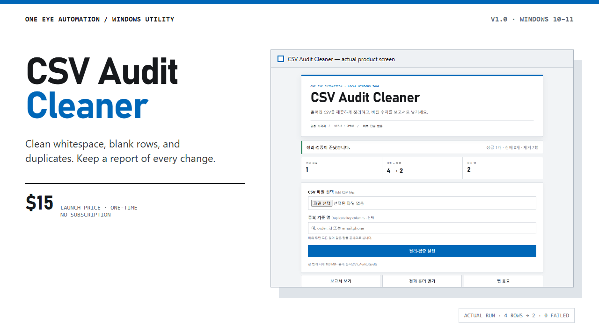
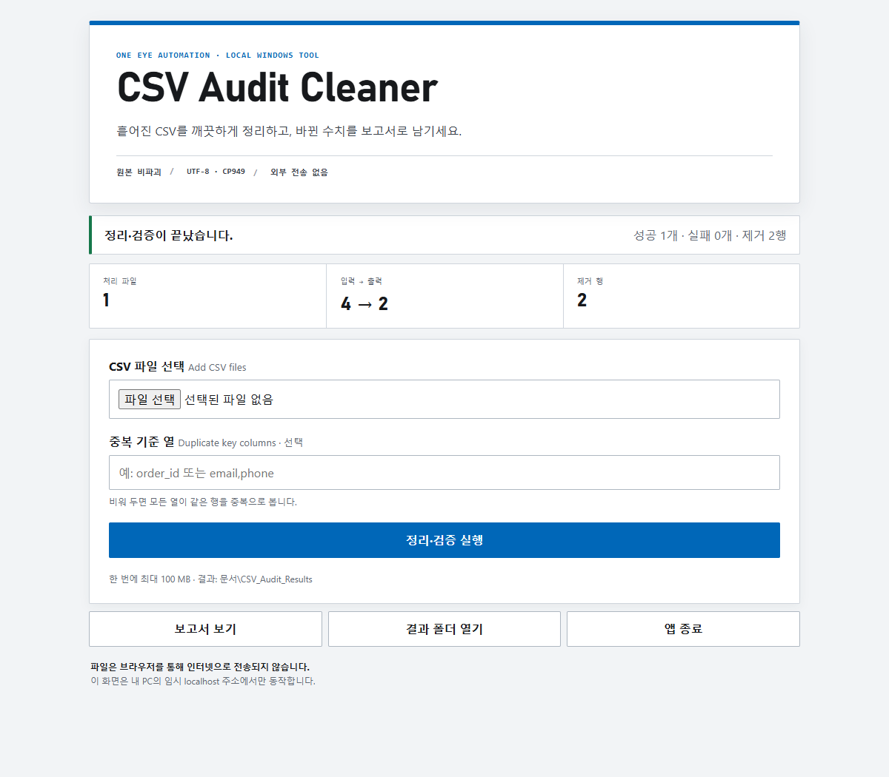

<p align="center">
  
</p>

# CSV Audit Cleaner Lite

Clean CSV whitespace, blank rows, and duplicates on a Windows PC, then keep an
HTML audit report and machine-readable run logs. Files stay on the computer;
the app does not upload CSV data to a cloud service.

[Download the free Lite release](https://github.com/loved0543-dotcom/csv-audit-cleaner-lite/releases/download/v1.0.0/CSV_Audit_Cleaner_Lite_v1.0.zip)
·
[Get the unlimited $15 version](https://lovelife717.gumroad.com/l/csv-audit-cleaner)
·
[View product details](https://oneeyeview-automation.vercel.app)

## What it does

- Trims leading and trailing whitespace.
- Removes fully blank rows.
- Removes exact duplicates or duplicates based on chosen key columns.
- Writes cleaned UTF-8 BOM CSV files without overwriting the originals.
- Produces an HTML audit report, JSON summary, and JSONL run log.
- Reads UTF-8, UTF-8 BOM, and CP949 CSV files.
- Runs through a temporary `127.0.0.1` address on the same PC.

<p align="center">
  
</p>

## Lite and full editions

| | Lite | Full |
|---|---:|---:|
| Price | Free | $15 one-time |
| Rows per CSV | Up to 100 data rows | Unlimited by edition |
| Batch size | Up to 100 MB per run | Up to 100 MB per run |
| HTML audit report | Yes | Yes |
| JSON and JSONL evidence | Yes | Yes |
| Cloud upload or telemetry | No | No |

The header row is not counted toward the Lite limit. The limit is checked
before a cleaned output file is written.

## Quick start

1. Download `CSV_Audit_Cleaner_Lite_v1.0.zip` from the release page.
2. Extract the complete ZIP into a new folder.
3. Double-click `CSV_Audit_Cleaner_Lite.exe`.
4. Add one or more CSV files and optionally enter duplicate-key columns.
5. Select **Clean & verify**, then inspect the generated report.
6. Select **Exit app** when finished.

Windows 10/11 64-bit is required. No installation, Python setup, cloud account,
subscription, paid API, or administrator access is required.

## Verify the download

Release file:

```text
CSV_Audit_Cleaner_Lite_v1.0.zip
11,174,017 bytes
SHA-256 454E5027D3423A792E47B7297AC07C5371D7AAE4486008F3A964A71BEB1D39B1
```

PowerShell verification:

```powershell
Get-FileHash .\CSV_Audit_Cleaner_Lite_v1.0.zip -Algorithm SHA256
```

The release was checked with 31 automated tests and a real Windows launch,
including the 101-row rejection path. The included Python launcher has a valid
Python Software Foundation Authenticode signature.

## Scope

This edition does not edit Excel workbooks, PDFs, images, or values using AI.
It does not automate browser logins or bypass CAPTCHAs. Keep backups and verify
results before using cleaned files in production.

Copyright (c) 2026 One Eye Automation. See [LICENSE.txt](LICENSE.txt).
